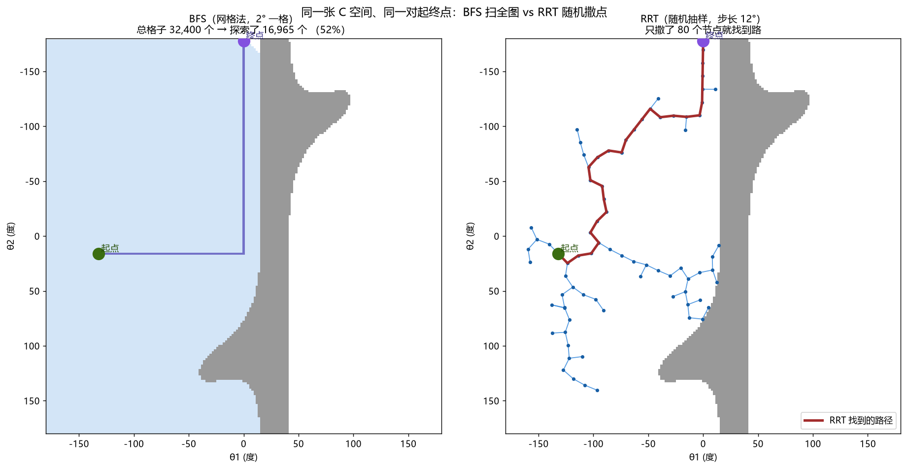
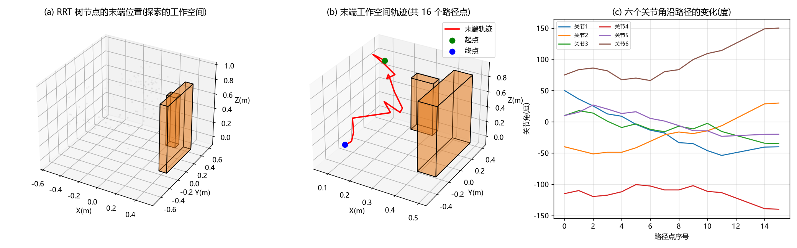
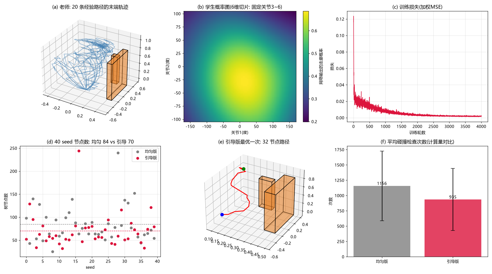

# Learning-and-Sampling Hybrid Motion Planning for a 6-DOF Manipulator

复杂受限环境下多自由度机械臂基于学习和抽样的混合运动规划算法研究
（大学生科研训练项目 · 结项代码仓库）

本项目在 PyBullet 物理仿真环境中，对 Franka Panda 机械臂（冻结第 7 关节，等效六自由度）实现了
**RRT 抽样运动规划 → 路径平滑 → RRT\* 优化 → 时间参数化 → 神经网络引导采样** 的完整算法链，
并以二维双杆臂作为可穷举验证案例，对每一步算法做了对照实验。

---

## 方法流水线

```
二维双杆臂（方法验证，结果可穷举对照）
  正运动学 → C 空间栅格 + BFS 穷举 → RRT → 路径平滑 → RRT* → 梯形速度时间参数化 → 学习引导采样
                                        │
                                        ▼ 迁移
六自由度 Panda（主线，PyBullet 碰撞检测）
  场景建模（墙 + 柱） → 6 维 RRT + 边碰撞检查 → 经验路径作为教师信号 → 神经网络引导采样
```

## 核心结果

| 实验 | 对照 | 结果 |
| --- | --- | --- |
| 2D：RRT vs BFS 穷举 | BFS 探索 16,965 / 32,400 格 | RRT 仅 **157 节点（0.9%）** |
| 2D：随机捷径平滑 | 300.3° | **234.6°（-21.9%）** |
| 2D：RRT\* | 332.17° | **278.94°（-16%）**，anytime 收敛 235.64° ≈ 平滑极限 234.6°（两路线互证最优） |
| 2D：学习引导采样（40 seed） | 均匀采样 80.2±15.7 节点 | 引导后 **57.6±12.6（72%）** |
| 6D：RRT vs 网格穷举 | 2° 分辨率 6 维网格 ≈ 5.2×10¹² 格 | RRT 仅 **1393 次碰撞检查**（约 1/3.7×10⁹），108 节点 / 0.95 s |
| 6D：学习引导采样（40 seed） | 均匀采样 84.3±38.8 节点 / 1156±568 次检查 | 引导后 **69.8±35.9（82.8%）/ 935±507（80.8%）**，教师-学生相关性 corr = 0.945 |

## 效果图

| 2D：BFS 穷举 vs RRT 抽样 | 6D：RRT 规划结果 | 6D：学习引导采样 |
| :---: | :---: | :---: |
|  |  |  |

## 目录结构

```
arm-motion-planning/
├── 2d_pipeline/        # 二维双杆臂方法验证链（lesson1~7）
│   ├── lesson1_forward_kinematics.py   # 正运动学
│   ├── lesson2_cspace.py               # C 空间栅格 + 碰撞查询 + BFS 最短路
│   ├── lesson3_rrt.py                  # RRT（BFS 对照）
│   ├── lesson4_path_smooth.py          # 随机捷径平滑
│   ├── lesson5_rrt_star.py             # RRT*（choose-parent + rewire）
│   ├── lesson6_time_param.py           # 弧长重采样 + 梯形速度时间参数化
│   └── lesson7_learned_sampling.py     # 2D 学习引导采样（BFS 走廊标签教师）
├── 6dof_panda/         # 六自由度主线（PyBullet Franka Panda，冻结关节 7）
│   ├── lesson10_6dof_rrt.py            # 6 维 RRT + 边碰撞检查
│   ├── lesson10_scene_gui.py           # GUI 教学台（关节滑块 + 碰撞实时反馈）
│   └── lesson11_6dof_learned_sampling.py # 6 维学习引导采样（经验路径教师）
├── report/             # 结项报告
│   ├── lesson13_report_final.py        # 报告生成脚本（python-docx）
│   └── lesson13_report_final.docx      # 结项报告全文
├── archive/            # 过程与调试脚本（C 空间诊断、自建 UR5 模型、旧版报告草稿）
├── requirements.txt
└── README.md
```

## 快速开始

环境：Python 3.12，Windows / Linux 均可（本项目在 Windows 11 上开发验证）。

```bash
pip install -r requirements.txt -i https://pypi.tuna.tsinghua.edu.cn/simple
```

> 注意：Python 3.12 下 PyBullet 无预编译 wheel，需源码编译。
> Windows 需先安装 [Visual Studio 2022 生成工具](https://visualstudio.microsoft.com/visual-cpp-build-tools/)
> （勾选 "使用 C++ 的桌面开发" 工作负载），再 `pip install pybullet`，约 3 分钟编译完成。

各脚本自包含、相互独立（lesson4~7 会从同目录的 lesson3_rrt 导入公共函数），在对应目录下直接运行：

```bash
cd 2d_pipeline  && python lesson3_rrt.py     # 2D RRT + BFS 对照
cd 6dof_panda   && python lesson10_6dof_rrt.py    # 6 维 RRT（约 1 分钟）
cd 6dof_panda   && python lesson11_6dof_learned_sampling.py  # 学习引导（约 5 分钟）
```

## 技术要点

1. **边碰撞检查（离散盲区修正）**：RRT 若只检查落脚点构型，步长 0.35 rad 时 300 个中间构型中有 9 个穿透障碍。
   本项目对每条边做 12 细分插值检查，杜绝"只查桩位、不查桩间连线"的盲区。
2. **自碰撞白名单**：Panda 腕部法兰/手爪连杆天然贴近腕关节，直接启用自碰撞会产生大量假阳性；
   通过 `getClosestPoints` 诊断负距离连杆对，构建白名单过滤。
3. **教师信号尺度参数数据驱动**：6 维学习引导中固定衰减尺度 τ=0.40 时，随机采样点到经验走廊的
   最近距离中位数达 2.30 rad，标签几乎全零（走廊占比 0.0%，corr 为负）。改为取距离分布的
   15 分位数（τ=1.60）后，走廊占比 3.5%，corr 提升至 **0.945**。
4. **引导收益随维度边际递减**：2D 引导收益 72%，6D 为 82.8%（节点比），但 6D 中 RRT 本身已被
   goal bias 引导得较高效，走廊引导的边际收益相对下降——详见报告 Discussion。

## 参考文献

1. LaValle, S. M. *Rapidly-exploring random trees: A new tool for path planning*. TR 98-11, Computer Science Dept., Iowa State University, 1998.
2. Karaman, S., & Frazzoli, E. *Sampling-based algorithms for optimal motion planning*. IJRR, 2011.
3. Ichter, B., Harrison, J., & Pavone, M. *Learning sampling distributions for robot motion planning*. ICRA, 2018.
4. Coumans, E., et al. *PyBullet: A Python module for physics simulation*. https://pybullet.org

## 声明

本项目为本科生科研训练课题的结项成果，代码与报告均为作者独立完成，仅供学习交流。
